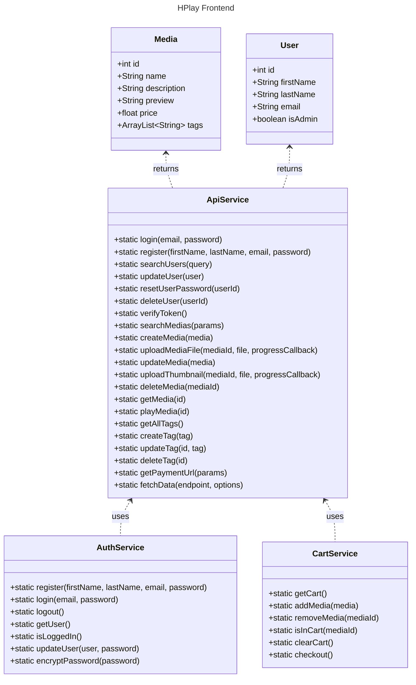

# Class Diagram

```mermaid
---
title: HPlay Frontend
---

classDiagram
    class Media {
        +int id
        +String name
        +String description
        +String preview
        +float price
        +ArrayList~String~ tags
    }

    class User {
        +int id
        +String firstName
        +String lastName
        +String email
        +boolean isAdmin
    }

    class ApiService {
        +static login(email, password)
        +static register(firstName, lastName, email, password)
        +static searchUsers(query)
        +static updateUser(user)
        +static resetUserPassword(userId)
        +static deleteUser(userId)
        +static verifyToken()
        +static searchMedias(params)
        +static createMedia(media)
        +static uploadMediaFile(mediaId, file, progressCallback)
        +static updateMedia(media)
        +static uploadThumbnail(mediaId, file, progressCallback)
        +static deleteMedia(mediaId)
        +static getMedia(id)
        +static playMedia(id)
        +static getAllTags()
        +static createTag(tag)
        +static updateTag(id, tag)
        +static deleteTag(id)
        +static getPaymentUrl(params)
        +static fetchData(endpoint, options)
    }

    class AuthService {
        +static register(firstName, lastName, email, password)
        +static login(email, password)
        +static logout()
        +static getUser()
        +static isLoggedIn()
        +static updateUser(user, password)
        +static encryptPassword(password)
    }

    class CartService {
        +static getCart()
        +static addMedia(media)
        +static removeMedia(mediaId)
        +static isInCart(mediaId)
        +static clearCart()
        +static checkout()
    }

    ApiService <.. AuthService : uses
    ApiService <.. CartService : uses
    Media <.. ApiService : returns
    User <.. ApiService : returns
```